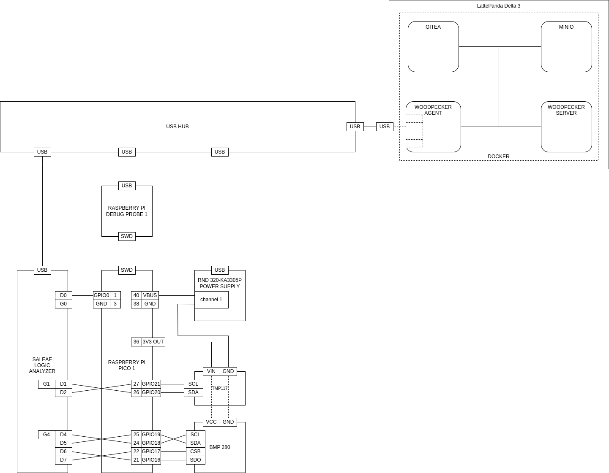

# Embedded CI
A proof-of-concept for a CI system meant for embedded software development

This README currently functions as a journal to track my progress and ideas.

## Purpose
To create a simple CI setup which will assist me when learning Embedded Rust.
The aim is to use a [LattePanda 3 Delta](https://www.lattepanda.com/lattepanda-3-delta)
as the CI server and connect it to two Raspberry Pi Picos and a Saleae logic
analyzer.

It should be possible to:
* build embedded Rust source code
* flash it to either Raspberry Pi Pico
* use Saleae's Automation API to run tests on the Picos

Note: I initially wanted to use a Raspberry Pi 4 but Saleae's Logic [does not
have binaries for ARM](https://support.saleae.com/faq/technical-faq/can-logic-run-on-arm)

## Current approach
I am running [NixOS](https://nixos.org/) on the LattePanda and a dockerized
Woodpecker server + agent combo which get started by docker compose. Minimal
security to begin with, just to get the ball rolling.

## System diagram

## Steps
- Install NixOS 23.05 and use the `configuration.nix` file from my `configfiles`
  [repository](https://github.com/Daedrus/configfiles) together with the
  `embci.nix` file from this repository.
- Note that the Woodpecker agent is currently running in privileged mode
  since I couldn't get it to work with the debug probe and the analyzer
  otherwise. I hope to fix this in the future.
- Set up an environment variable containing the LattePanda's IP address,
  for example `export IP_ADDRESS=192.168.0.104`. This variable is used
  by `docker-compose.yml`. For the instructions below, replace `$IP_ADDRESS`
  with the IP address.
- Start the Gitea container
  `docker compose up -d gitea`
- Access http://$IP_ADDRESS:3000/ in your browser
- Configure the admin user in `Optional Settings` then click `Install Gitea`
- Go to `http://$IP_ADDRESS:3000/user/settings/applications` and in
  `Manage OAuth2 Applications` choose:  
  `Application Name: Woodpecker CI`  
  `Redirect URI: http://$IP_ADDRESS:8000/authorize`  
  Make sure that the `Confidential Client` checkbox is ticked and then click
  `Create Application`  
  Copy the `Client ID` in the `WOODPECKER_GITEA_CLIENT` variable in `.env`  
  Copy the `Client Secret` in the `WOODPECKER_GITEA_SECRET` variable in `.env`  
  Finally click `Save`
- Create an agent secret  
  `openssl rand -base64 32`  
  and add the output to the `WOODPECKER_AGENT_SECRET` variable in `.env`
- Start the Woodpecker server and agent containers
  `docker compose up -d`
- Go back to Gitea, mirror the `https://github.com/Daedrus/embci-example-repo`
  repository
- Add that repository to Woodpecker and run the pipeline
- Things should work out of the box provided that your hardware setup is
  similar to mine and (if different) you have made the necessary changes.
